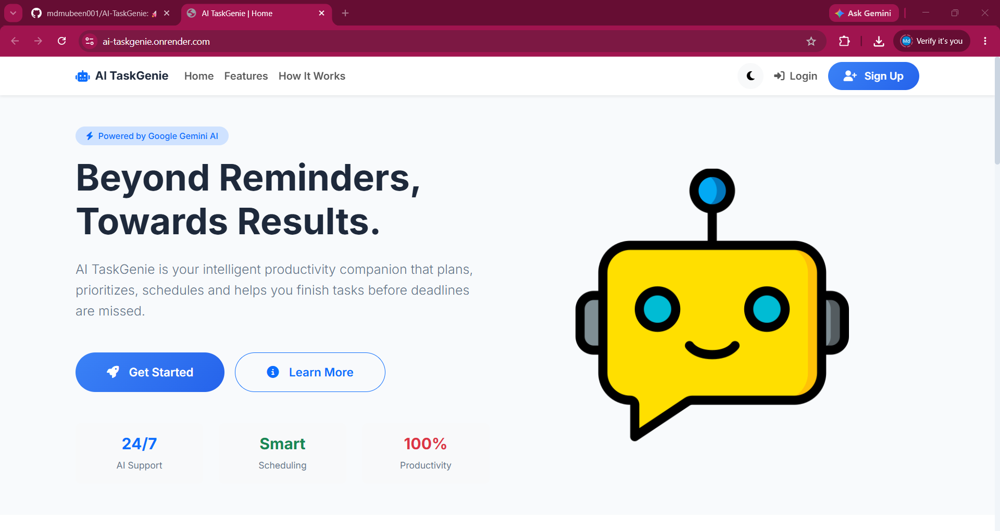
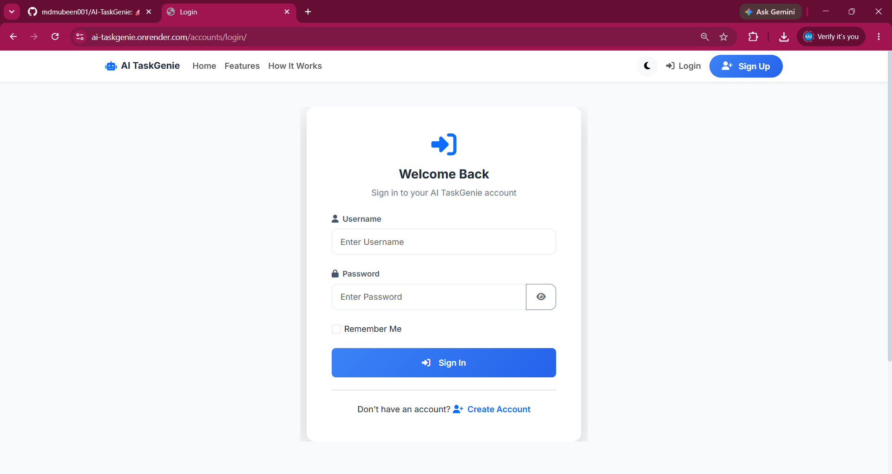
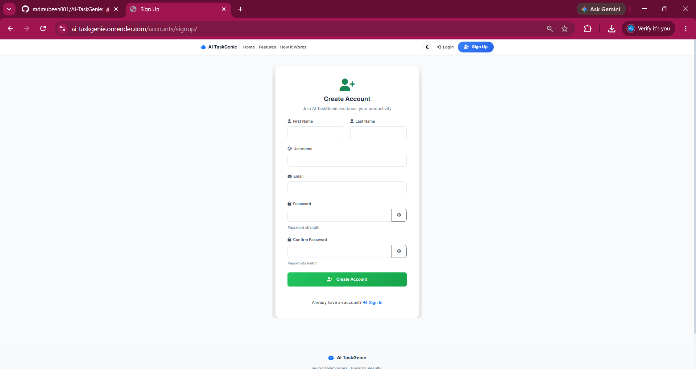
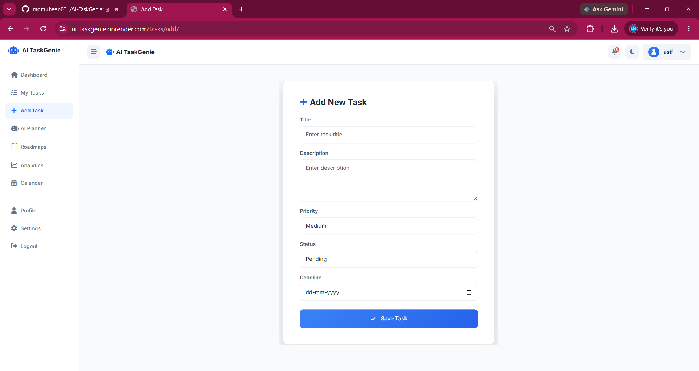
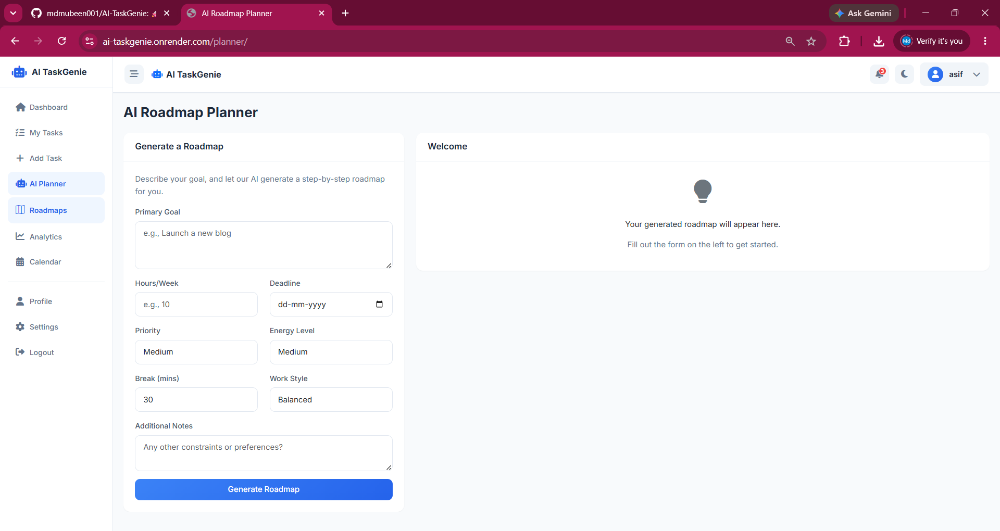
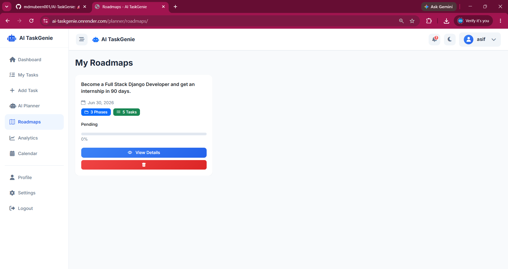
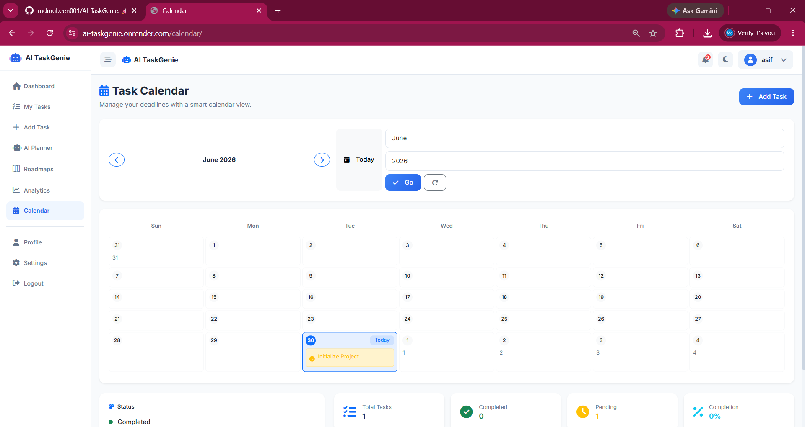
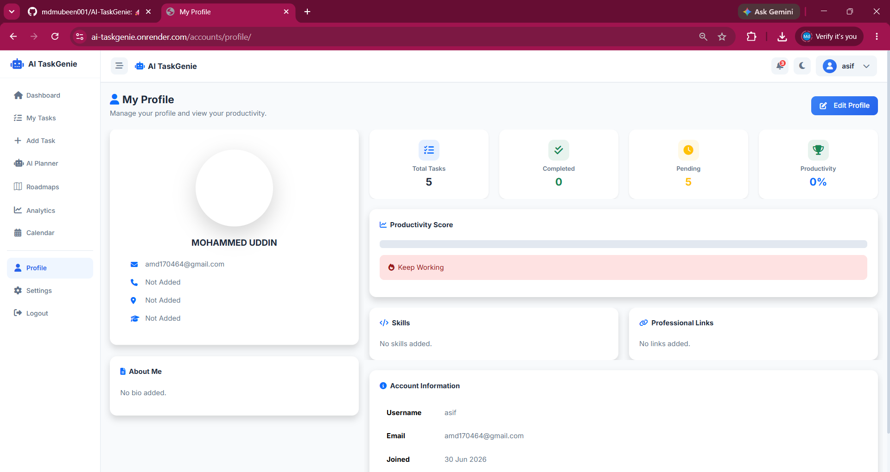
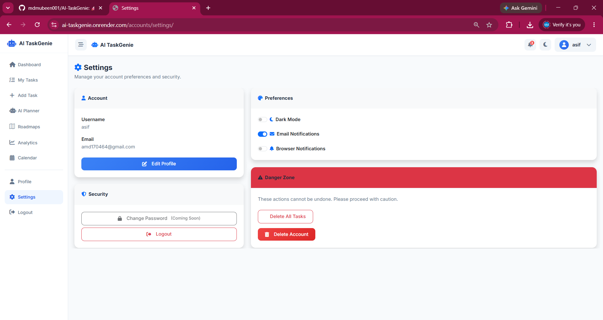
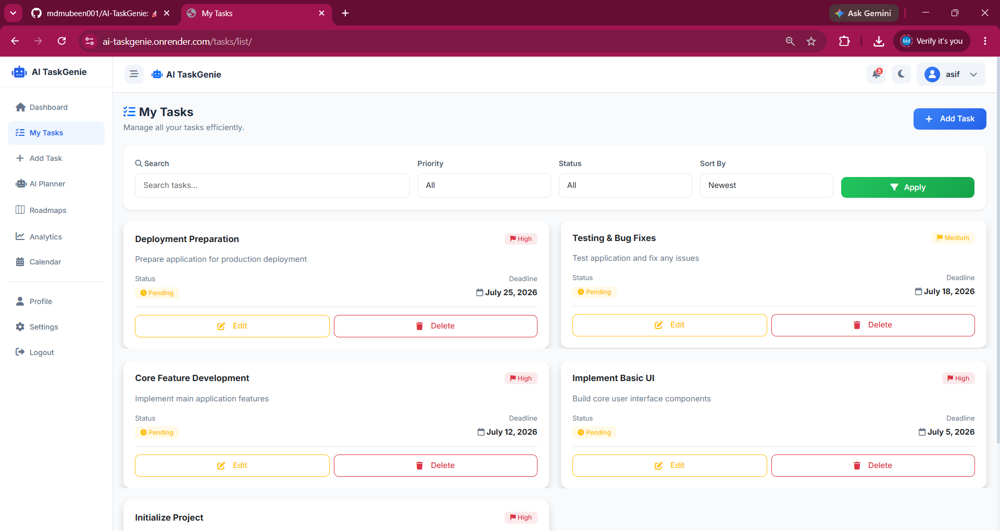

# 🚀 AI TaskGenie

### AI-Powered Productivity Companion built with Django + Gemini AI

Never miss deadlines again!

AI TaskGenie is an AI-powered productivity companion that intelligently prioritizes tasks, generates AI roadmaps, provides analytics, manages schedules, and helps users complete their goals before deadlines.

> 🏆 Built for **Coding Ninjas × Google for Developers – Vibe2Ship Hackathon**
>
> Problem Statement: **The Last-Minute Life Saver**

---

## 🌐 Live Demo

🔗 https://ai-taskgenie.onrender.com

---

## ✨ Features

- 🔐 Secure User Authentication (Signup/Login)
- 📋 Smart Task Management
- 🤖 AI Roadmap Generator using Google Gemini AI
- 📅 Calendar Planning
- 📊 Productivity Analytics Dashboard
- 📈 Task Progress Tracking
- 🎯 Personalized Productivity Recommendations
- 📝 Roadmap Approval Workflow
- 📱 Responsive UI

---

## 🛠️ Tech Stack

### Frontend

- HTML5
- CSS3
- JavaScript
- Bootstrap

### Backend

- Django 6
- Python

### AI

- Google Gemini AI

### Database

- SQLite

### Deployment

- Render

### Version Control

- Git & GitHub

---

## 📂 Project Structure

```text
AI-TaskGenie/
│
├── accounts/
├── analytics/
├── calendar_app/
├── config/
├── planner/
├── static/
├── tasks/
├── templates/
├── manage.py
├── requirements.txt
├── Procfile
├── build.sh
└── README.md
```

---

## ⚙️ Installation

Clone the repository

```bash
git clone https://github.com/mdmubeen001/AI-TaskGenie.git
```

Go to project folder

```bash
cd AI-TaskGenie
```

Create virtual environment

```bash
python -m venv venv
```

Activate virtual environment

Windows

```bash
venv\Scripts\activate
```

Install dependencies

```bash
pip install -r requirements.txt
```

Run migrations

```bash
python manage.py migrate
```

Start server

```bash
python manage.py runserver
```

---

## 🤖 AI Workflow

```
User Login
      │
      ▼
Dashboard
      │
      ▼
Create Task
      │
      ▼
Gemini AI
      │
      ▼
AI Roadmap Generation
      │
      ▼
Analytics & Progress Tracking
```

---

## 🎯 Use Cases

- Students
- Professionals
- Entrepreneurs
- Freelancers
- Project Teams

---

## 🚀 Future Enhancements

- Google Calendar Sync
- Email Notifications
- Voice Assistant
- AI Auto Scheduling
- Mobile App
- Team Collaboration
- Dark Mode

---

# 📸 Application Screenshots

## 🏠 Home Page



---

## 🔐 Login



---

## 📝 Signup



---

## 📊 Dashboard

.png)

---

## ➕ Add Task



---

## 🤖 AI Planner



---

## 🛣️ AI Roadmap



---

## 📅 Calendar



---

## 📈 Analytics

.png)

---

## 👤 Profile



---

## ⚙️ Settings



---

## ✅ Tasks



---

## 📈 Project Highlights

- AI-powered productivity assistant
- Personalized roadmap generation
- Intelligent task prioritization
- Interactive analytics dashboard
- Clean and responsive UI
- Secure authentication
- Cloud deployment using Render

---

## 👨‍💻 Developer

**Mohammed Mubeen**

GitHub:
https://github.com/mdmubeen001

LinkedIn:
https://www.linkedin.com/in/md-mubeen-389b27247/

---

## 📄 License

This project is developed for educational and hackathon purposes.

MIT License
